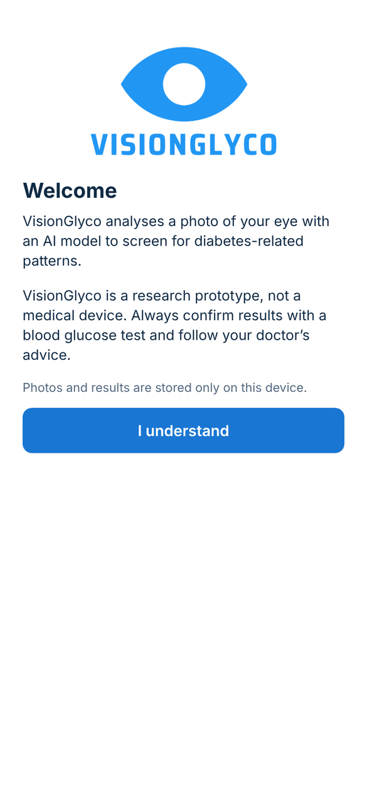
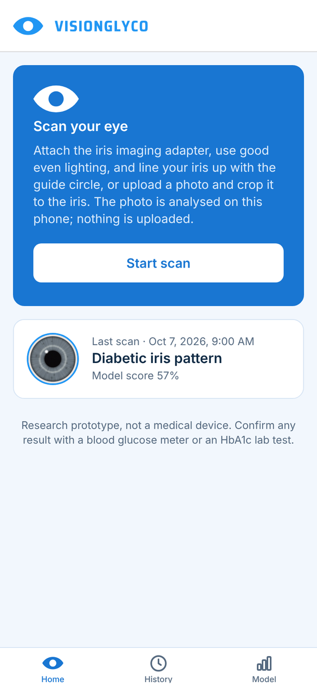
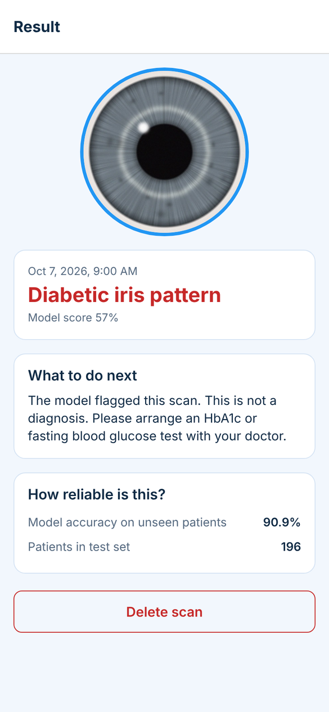
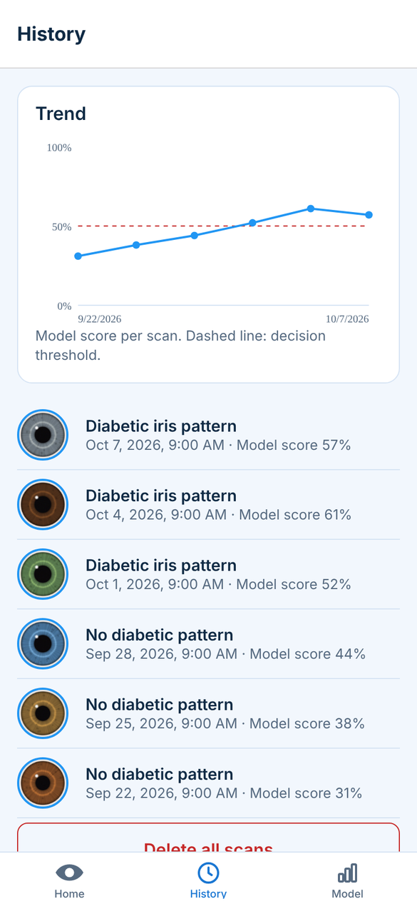
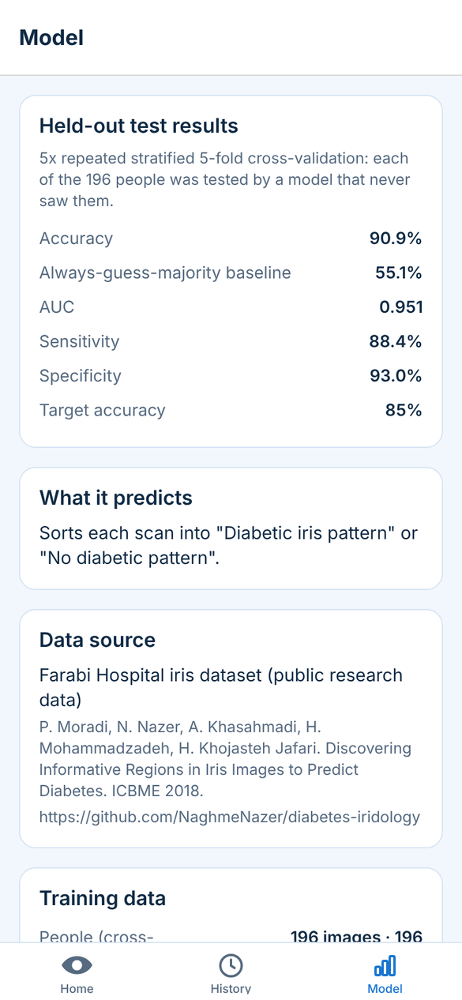
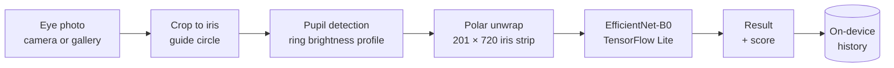

<p align="center">
  
</p>

<h3 align="center">AI-powered, non-invasive diabetes screening from a photo of the eye</h3>

<p align="center">
  
  
  
  
  
  
</p>

---

## About

Monitoring diabetes today means finger-prick tests, test strips and sensors: painful,
costly and hard to keep up, especially for children. **VisionGlyco** explores a
pain-free alternative: take a photo of the eye with a smartphone and let an AI model
screen it for diabetes-related patterns, directly on the phone.

The project has two parts:

- **VisionGlyco mobile app** – captures or uploads an eye photo, finds the iris and pupil,
  runs a deep-learning model on the device, and keeps a history of results.
- **VisionGlyco AI pipeline** – trains, evaluates and exports the computer-vision model that
  the app uses.

## Features

| | |
|---|---|
| 📷 **Eye capture** | Camera with an iris guide circle and pupil target, flash toggle, front/back camera, or upload from the gallery with a square crop editor |
| 🧠 **On-device AI** | EfficientNet-B0 model running with TensorFlow Lite; works fully offline |
| 👁️ **Iris processing** | Automatic pupil detection and polar "unwrapping" of the iris before analysis |
| 📊 **Results & trends** | Clear result screen, scan history and a trend chart of model scores over time |
| 📈 **Model transparency** | In-app screen with accuracy, AUC, sensitivity, specificity and dataset details |
| 🔒 **Private by design** | Photos and results never leave the phone |

## Screenshots

<p align="center">
  &nbsp;
  &nbsp;
  &nbsp;
  &nbsp;
  
</p>
<p align="center"><sub>Welcome · Home · Result · History · Model</sub></p>

## How it works



1. **Capture** – the user lines the iris up with the on-screen guide circle (or crops a
   gallery photo to the iris).
2. **Pupil detection** – the app averages brightness in concentric rings around the
   centre to find the pupil edge.
3. **Iris unwrapping** – the ring between pupil and iris edge is unrolled into a
   201 × 720 strip, the format the model was trained on.
4. **Inference** – an EfficientNet-B0 network with a trained classification head scores
   the strip on the phone.
5. **Result** – the app shows *Diabetic iris pattern* or *No diabetic pattern* with the
   model score, and saves it to the history.

## AI model

The model currently in the app was trained on a public research dataset of iris images
from people with and without diabetes, collected under the supervision of
ophthalmologists at Farabi Hospital.

| | |
|---|---|
| **Dataset** | 196 people: 88 diabetic, 108 non-diabetic; one iris image per person |
| **Architecture** | EfficientNet-B0 (ImageNet pretrained) features + logistic-regression head |
| **Evaluation** | 5 × repeated 5-fold cross-validation; every person tested by a model that never saw them |
| **Deployment** | Single TensorFlow Lite model (float16), ~8 MB |

| Metric | Result |
|---|---|
| **Accuracy** | **90.9% ± 2.0%** |
| AUC | 0.951 |
| Sensitivity | 88.4% |
| Specificity | 93.0% |
| Baseline (always "non-diabetic") | 55.1% |

Details and reproduction steps: [`ml/experiments/iridology/`](ml/experiments/iridology/README.md).

## Tech stack

| Area | Technologies |
|---|---|
| Mobile app | React Native 0.86, Expo SDK 57, Expo Router, TypeScript |
| On-device AI | TensorFlow Lite via `react-native-fast-tflite` |
| Camera & images | `expo-camera`, `expo-image-picker`, `expo-image-manipulator`, `jpeg-js` |
| Charts & graphics | `react-native-svg` |
| Storage | AsyncStorage + device file system |
| Model training | Python 3.13, TensorFlow / Keras 3, scikit-learn, NumPy, Pillow |
| Testing | Jest (app), pytest (ML pipeline) |

## Project structure

```
VisionGlyco-AI-Model/
├── mobile/                     React Native (Expo) app
│   ├── src/app/                Screens (Expo Router)
│   ├── src/ml/                 Image preprocessing, iris unwrapping, TFLite inference
│   ├── src/components/         UI components, logo, trend chart
│   ├── src/storage/            On-device scan history
│   └── assets/                 App icon, splash, logo, bundled AI model
├── ml/                         AI training pipeline
│   ├── train.py                Train → evaluate → export TFLite → install into the app
│   ├── predict.py              Run the exported model on images
│   ├── visionglyco/            Data loading, model, metrics, iris unwrapping
│   ├── experiments/iridology/  Model trained on the public iris dataset
│   └── tests/                  pytest suite
└── docs/screenshots/           App screenshots
```

## Getting started

### Run the app

Requirements: Node.js 20+, and either Android Studio (Android) or Xcode (iOS, macOS only).

```bash
git clone https://github.com/Asad3404/VisionGlyco-AI-Model.git
cd VisionGlyco-AI-Model/mobile
npm install
npx expo run:android      # or: npx expo run:ios
```

No Android Studio? Build an installable APK in the cloud with Expo EAS:

```bash
npx eas-cli@latest build --profile development --platform android
```

The app uses native modules (camera, TensorFlow Lite), so it needs a development build;
it does not run in Expo Go.

### Train a model

```bash
cd ml
python -m venv .venv && source .venv/bin/activate
pip install -r requirements.txt

python train.py --labels data/labels.csv --images-dir data/images --install-to-app ../mobile
```

`labels.csv` lists each image with a patient ID and its measurement (for example HbA1c).
The script splits data by patient, trains with transfer learning, reports held-out
metrics, exports a TensorFlow Lite model and installs it into the app. See
[`ml/README.md`](ml/README.md).

### Run the tests

```bash
cd mobile && npm test          # app unit tests
cd ml && pytest                # ML pipeline tests
```

## Roadmap

- [x] Deep-learning computer-vision pipeline
- [x] Mobile app with on-device AI, history and trends
- [x] VisionGlyco branding: icon, splash screen and theme
- [ ] Collect VisionGlyco's own dataset with the imaging adapter, paired with HbA1c tests
- [ ] Train and release the VisionGlyco model on that dataset
- [ ] Cloud sync (Azure Mobile Apps + Azure SQL) and user accounts
- [ ] Automated alerts for parents of diabetic children
- [ ] Clinical validation study

## Acknowledgements

Iris dataset: P. Moradi, N. Nazer, A. Khasahmadi, H. Mohammadzadeh, H. Khojasteh Jafari,
*"Discovering Informative Regions in Iris Images to Predict Diabetes"*, ICBME 2018
([NaghmeNazer/diabetes-iridology](https://github.com/NaghmeNazer/diabetes-iridology)).

## Disclaimer

VisionGlyco is a research prototype and not a medical device. Always confirm results
with a blood glucose test and follow your doctor's advice.
